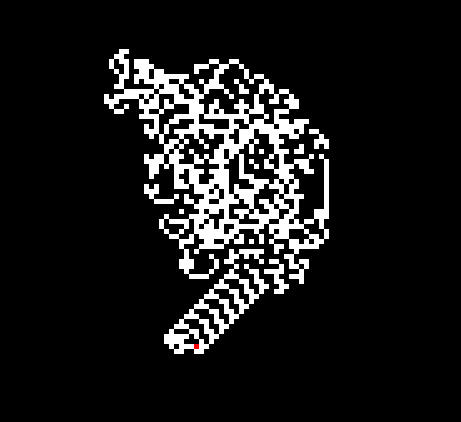

# **Mrówka Langtona** - **Kamil Butryn**

## **1. Opis programu**
Mrówka Langtona jest prostym automatem komórkowym, wymyślonym przez
Chrisa Langtona. Można ją również traktować jako bardzo prostą
**maszynę Turinga** ograniczoną do dwóch wymiarów.  
Mrówka zachowuje się według następujących zasad:  
1. Jeśli znajduje się na polu białym to obraca się w lewo (o kąt prosty),
zmienia kolor pola na czarny i przechodzi na następną komórkę
2. Jeśli znajduje się na polu czarnym to obraca się w prawo
(o kąt prosty), zmienia kolor pola na biały i przechodzi na następną komórkę
3. Porusza się na nieskończonej planszy podzielonej na kwadratowe
komórki (pola) w dwóch możliwych kolorach: czarnym i białym  

Dokładne informacje na temat mrówki Langtona można znaleźć na stronie: https://pl.wikipedia.org/wiki/Mr%C3%B3wka_Langtona

----------

## **2. Opis interfejsu**
Program wizualizuje ruch mrówki Langtona za pomocą systemowego okna.
W przypadku uruchomienia programu z opcją rysowania,
pierwsza próba zamknięcia okna spowoduje rozpoczęcie ruchu mrówki.
Kolejna próba podczas ruchu mrówki zatrzyma ją, po czym następna operacja
zamknie ostatecznie program.

Jedna z klatek podczas działania programu:  


----------

## **3. Implementacja**
Tworzenie okna, obsługa jego eventów oraz wyświetlanie klatek zostało
zaimplementowane przy użyciu biblioteki [PyGame](https://www.pygame.org/news).

Aplikacja jest podzielona klasy, każda zajmująca się
odpowiednią funkcjonalnością:  
`Ant` - zajmuje się ruchem mrówki,  
`Grid` - zajmuje się obsługą planszy oraz rysowaniem jej na ekranie,  
`Mechanic` - zajmuje się mechanikiem ruchu mrówki oraz łączy
funkcjonalności między nimi,
`Window` - zajmuje się stworzeniem okna i wyświetlaniem klatek,
`Langton` - zajmuje się powiązaniem okna i wyświetlania z mechaniką
mrówki Langtona.  
Plik `main` jest punktem uruchamiania programu, pobiera argumenty
i przekazuje je do klasy `Langton`.

Metoda zawierająca główną pętlę programu.

```py
def run(self):
        '''
        Funkcja zawiera glowna petle programu, wykonuje mechanike dzialania
        mrowki Langtona co klatke. Klatka wykonywana jest co okreslony czas.
        Po wyjsciu za ekran lub po pierwszej probie zamkniecia okna, program
        sie pauzuje.
        '''
        if self.drawing:
            self.draw_grid()
        start = time.time()
        while self.running:
            now = time.time()
            self.running = self.window.poll_events()
            if now - start >= self.frame_time:
                inBounds = self.mechanic.mechanic_step(self.window)
                self.window.swap_frame()
                start += self.frame_time
                if not inBounds:
                    self.running = False
        while True:
            if not self.window.poll_events():
                break
```

Funkcja `draw_grid` zajmuje się rysowaniem siatki wstępnej do ruchu mrówki
Langtona, o ile wywołana została aplikacja z argumentem `draw`.
Kolejno wykonywana jest pętla *while*, która wykonuje ruch mechaniki
działania mrówki przez funkcję `mechanic_step`, oraz aktualizowana klatka
zgodnie z określonym framerate'm.<br>

```py
def mechanic_step(self, window):
        '''
        Funkcja wykonuje krok mrowki i aktualiazuje plansze.
        '''
        gridVal = self.grid.step(self.ant.x, self.ant.y, window)
        self.ant.draw(window, self.grid)
        if gridVal == -1:
            return False
        elif gridVal == 0:
            self.ant.right()
        else:
            self.ant.left()
        return True
```
Powyższa funkcja wykonuje krok mrówki po planszy, używając jej koordynatów.

Najciekawszy jest sposób w jaki wykonywany jest ruch mrówki.

```py
class Ant:
    """
    Klasa reprezentujaca
    """
    def __init__(self, x, y):
        self.x = x
        self.y = y
        self.lastX = x
        self.lastY = y
        self.dir = (1, 0)
```
Na początku inicjalizowana jest jej pozycja oraz wektor kierunkowy.

```py
    def rotate_left(self):
            self.dir = (-self.dir[1], self.dir[0])

    def rotate_right(self):
        self.dir = (self.dir[1], -self.dir[0])
```
Następnie dokonywany jest obrót o 90 stopni w sposób jakby funkcje obliczać
za pomocą sinusa i cosuniusa (sin i cos będą wynosić 1 albo -1).

```py
    def forward(self):
            self.lastX = self.x
            self.lastY = self.y
            self.x += self.dir[0]
            self.y += self.dir[1]

    def left(self):
        self.rotate_left()
        self.forward()

    def right(self):
        self.rotate_right()
        self.forward()
```
Pozostałe funkcje od ruchu mrówki.

```py
class Grid:
    """
    Klasa reprezentujaca plansze, po ktorej porusza sie mrowka.
    """
    def __init__(self, w, h, windowW, windowH):
        '''
        Inicjalizacja planszy
        '''
        self.w = w
        self.h = h
        self.g = [[0 for y in range(h)] for x in range(w)]
        self.cellW = windowW / w
        self.cellH = windowH / h
```
Klasa `Grid` jest obiektem planszy ruchu mrówki. Polega na 2 wymiarowej
tablicy `g`.

```py
def step(self, x, y, window: Window):
        '''
        Funkcja wykonuje krok mrowki na planszy we wskazanym miejscu.
        '''
        if x >= self.w or y >= self.h or x < 0 or y < 0:
            return -1
        else:
            retVal = self.g[x][y]
            self.g[x][y] = 1 if self.g[x][y] == 0 else 0
            color = (255, 255, 255) if self.g[x][y] == 1 else (0, 0, 0)
            window.draw_rect(
                color, x * self.cellW, y * self.cellH, self.cellW, self.cellH)
            return retVal
```
Funkcja aktualizująca planszę na podstawie ruchu mrówki.

Kwestie dotyczące rysowania nie będę omawiał, gdyż nie są one częścią
działania automatu komórkowego.

----------

## **4. Sposób uruchomienia**
Aby uruchomić program należy wywołać komendę:  
`python main.py [szerokośc okna] [wysokość okna] [skala: domyślnie 10]`
`[klatki na sekundę: domyślnie 120] [Opcjonalne: draw]`  
Przykładowe uruchomienie:  
`python main.py 800 600 5 120 draw`

----------

## **5. Literatura**
https://pl.wikipedia.org/wiki/Mr%C3%B3wka_Langtona

----------

## **6. Wymagania**
**Python** - testowane na wersji **3.9.7**  
**PyGame** - testowane na wersji **2.1.2**
